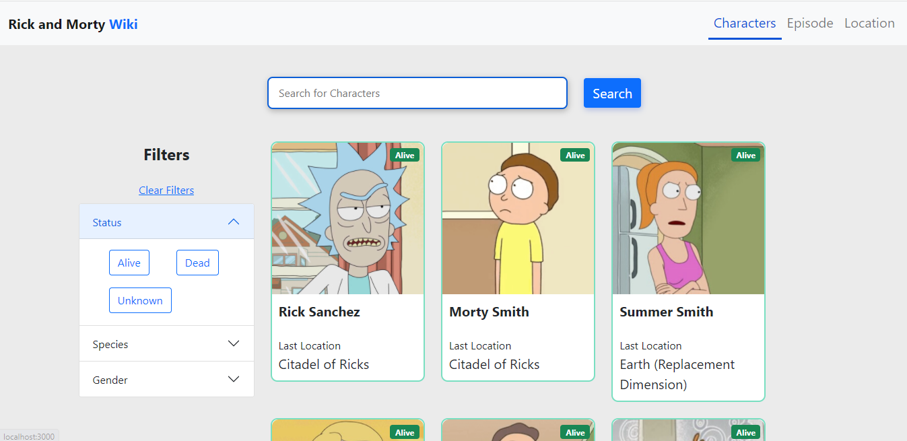

# Rick and Morty Character wiki

## _Rick is a mad scientist who drags his grandson, Morty, on crazy sci-fi adventures._

- Powered by
  > Rickandmortyapi.com
  > Discover and connect to thousands of rick and morty contents API.

## Live Site

- [Rickandmortyadventure](https://rickandmortyadventure.netlify.app/) - Live site

## Screenshot

;
;

##### This project is built with Reactjs : _A javaScript library for building web interface_.

- See HTML in the right
- ✨Magic ✨

## Features

- View all rick and morty characters
- search the api for specific character
- filter the content by species, gender, and status
- pagination
- select specific episode

This project helped me to undertand how to react hooks like useParams for dynamic routing

### learn

- learnt React best practices
- learn how to create user interfaces (UI) using bootstrap design.
- Learn how to create pagination using react-paginate

### Built with

- CSS custom properties
- Flexbox
- CSS Grid
- Mobile-first workflow
- React Hooks
- Context API
- [React](https://reactjs.org/) - JS library
- [Bootstrap ](https://getbootstrap.com/) - React UI library

## Installation

This project requires [Node.js](https://nodejs.org/) v10+ to run.

- clone the repo or download the zip file
  Install the dependencies and devDependencies and start the server.

```sh
cd to folder directory
npm install
node app
npm start
```

For production environments...

```sh
npm install --production
npm start
```

```

> Author: `--EBUKA Victor`.


## License

MIT


```
